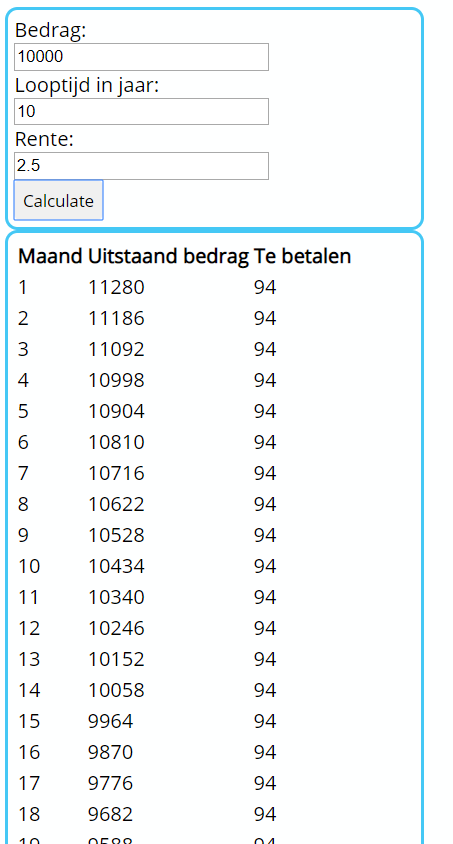

# oe-Programmastructuren_Functies-HypotheekBerekenen
Schrijf een javascript app waarmee we de afbetaling van een hypotheek kunnen berekenen.  

formule hypotheek met annuiteiten
### annuïteit = (maandrente / (1 - ((1 + maandrente) ^ - aantal periodes))) * hypotheekbedrag
#### ^ = machtsverheffing = Math.pow()
* Splits zo veel mogelijk logica in in functies
* Vul het table element(innerHTML) met rijen en kolommen
* splits de functies af in een afzonderlijke function file

